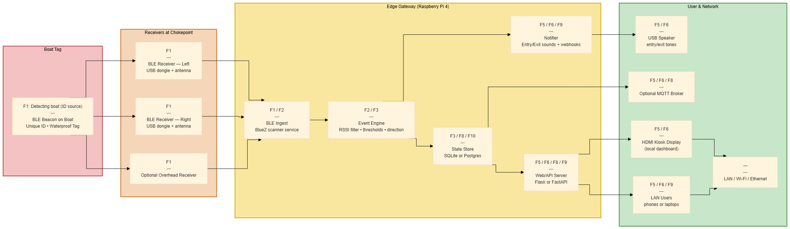
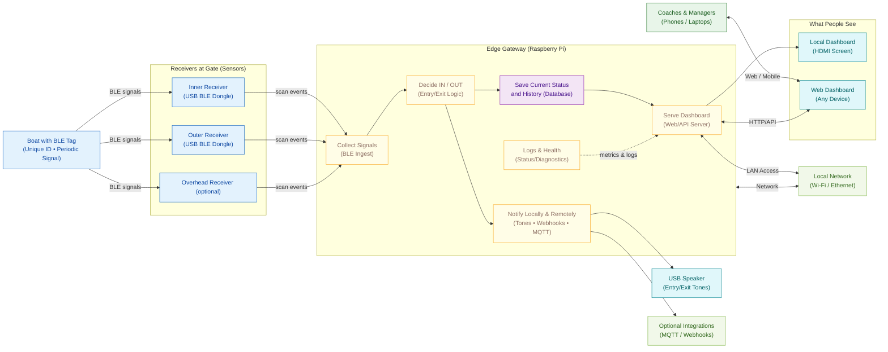

# Rowing Boat Tracking System

Multi-beacon BLE system for tracking boat presence and managing beacon-to-boat assignments. The system supports 30–40 boats with unique BLE beacons and provides a web dashboard and REST API.

## Overview

- Multi-scanner BLE ingestion (filtering to iBeacon frames)
- Database-backed boats, beacons, assignments, and detection history (SQLite by default)
- Web dashboard for presence and management
- REST API for integrations
- **NEW**: Trip tracking and water time analytics
- **NEW**: Multiple display modes (web dashboard + HDMI terminal display)
- **NEW**: Emergency boat notification system with WiFi-based alerts and vibration

## Script Organization

The system has been **consolidated and organized** for easier use and maintenance:

### **Root Directory (Clean & Organized)**
- **`start_system.sh`** - Main startup script (handles everything)
- **Core system files** - Essential Python modules and scripts
- **48% reduction** in root directory clutter (29 → 15 scripts)

### **Organized Script Structure**
```
scripts/
├── setup/
│   └── setup_system.sh              # Comprehensive system setup
├── management/
│   └── manage_system.sh             # System management (start/stop/status/logs)
├── testing/
│   └── test_system.sh               # Comprehensive testing suite
└── utilities/
    └── [14 legacy/utility scripts]  # Moved from root directory
```

### **Quick Commands**
```bash
# Setup everything
./scripts/setup/setup_system.sh --security --emergency

# Start system
./start_system.sh --security --emergency --display-mode both

# Manage system
./scripts/management/manage_system.sh start|stop|status|logs|test

# Test system
./scripts/testing/test_system.sh all|environment|hardware|software
```

## Software System Architecture

The diagram below shows the software system from BLE receivers to the web/API and users.



<small>Note: This is the software system architecture. It is not a hardware system architecture.</small>

### Stakeholder-Friendly Architecture (Mermaid)

You can also view the same architecture as a live Mermaid diagram (rendered by GitHub/GitLab viewers):



Why this design works (non‑technical justification):
- Two receivers at a narrow passage give reliable direction (inside→outside or outside→inside).
- The gateway decides once, stores the result, and immediately updates displays and notifications.
- If the network is slow or down, detections still store locally and show on the screen; integrations catch up later.
- All parts are replaceable: different receivers, different database, or different dashboard without changing the core idea.

## Prerequisites

- Python 3.10+
- Linux with BLE support (BlueZ). Ensure your user can access the BLE adapter.
- Raspberry Pi (recommended) with HDMI output for terminal display

## Fresh Raspberry Pi Setup (Complete Guide)

### Step 1: SSH into Raspberry Pi
```bash
ssh pi@<RPI_IP> -p 2222
```

### Step 2: One-Command Setup
```bash
# Clone the repository
git clone https://github.com/ksumit12/ENGN8170_group_project.git
cd ENGN8170_group_project

# Run comprehensive setup with all features
./scripts/setup/setup_system.sh --security --emergency
```

### Step 3: Start the System
```bash
# Start with all features enabled
./start_system.sh --security --emergency --display-mode both

# Or use the management script
./scripts/management/manage_system.sh start
```

### Step 4: Verify Installation
```bash
# Test the system
./scripts/testing/test_system.sh all

# Check system status
./scripts/management/manage_system.sh status
```

## Running the System

### Quick Start
```bash
# Start with all features
./start_system.sh --security --emergency --display-mode both

# Basic start
./start_system.sh

# Start with specific options
./start_system.sh --display-mode web --api-port 8000 --web-port 5000
```

### System Management
```bash
# Start system
./scripts/management/manage_system.sh start

# Check status
./scripts/management/manage_system.sh status

# View logs
./scripts/management/manage_system.sh logs system

# Stop system
./scripts/management/manage_system.sh stop

# Restart system
./scripts/management/manage_system.sh restart
```

### Testing
```bash
# Run all tests
./scripts/testing/test_system.sh all

# Test specific components
./scripts/testing/test_system.sh environment
./scripts/testing/test_system.sh hardware
./scripts/testing/test_system.sh software
```

## Stopping the System

### Quick Stop (All Processes)
```bash
# Stop all system processes
./scripts/management/manage_system.sh stop
```

### Manual Stop
```bash
# Stop specific processes
pkill -f "boat_tracking_system.py"
pkill -f "ble_scanner.py"
pkill -f "api_server.py"
```

## Script Consolidation Benefits

The system has been **significantly reorganized** for better usability:

### **Before (Cluttered)**
- 29 scripts scattered in root directory
- Multiple overlapping setup scripts
- Hard to find the right script
- Duplicate functionality across files

### **After (Organized)**
- 15 scripts in root directory (**48% reduction**)
- Clear organization by function
- Single comprehensive scripts for complex operations
- All functionality preserved, just better organized

### **Key Improvements**
- **`start_system.sh`** - Single command to start everything
- **`scripts/management/manage_system.sh`** - Complete system control
- **`scripts/testing/test_system.sh`** - Comprehensive testing suite
- **`scripts/setup/setup_system.sh`** - One-time complete setup
- **`scripts/utilities/`** - Legacy scripts organized separately

### **Usage Examples**
```bash
# Complete setup in one command
./scripts/setup/setup_system.sh --security --emergency

# Start with all features
./start_system.sh --security --emergency --display-mode both

# Manage system operations
./scripts/management/manage_system.sh start|stop|status|logs|test|maintenance

# Comprehensive testing
./scripts/testing/test_system.sh all|environment|hardware|software|features|integration
```

## Physical Hardware Setup

### BLE Scanner Placement
You need **two BLE scanners** with 2m USB extensions:

1. **Inner Scanner (gate-inner)**:
   - Place **inside the shed**
   - Mount on wall/post inside, ~1m from boat storage area
   - Should detect boats when fully inside

2. **Outer Scanner (gate-outer)**:
   - Place **outside the shed**
   - Mount on external wall/post, ~1m from water access point
   - Should detect boats when on water side

### BLE Beacon Configuration
Configure your beacons for **~1-1.5 meter detection radius**:
- **Transmission Power**: Medium/low (not maximum)
- **Advertising Interval**: 100-200ms (faster = more frequent detections)
- **Range**: ~1m detection radius per scanner

### Testing Setup
1. **Test Range**: Place beacon at different distances from each scanner
2. **Verify Sequence**: Walk beacon from inside → outside and confirm detection sequence
3. **Check FSM**: Verify state transitions in web dashboard

## New Features

### Trip Tracking & Analytics
- **Water Time Today**: New column showing total minutes each boat spent on water today
- **Trip History**: Complete log of all boat trips with duration
- **Usage Analytics**: Track most-used boats and total service hours
- **Admin Logs**: Trip data saved in admin page logs

### Display Modes
- **Web Dashboard**: Full interactive interface with all features
- **Terminal Display**: Clean HDMI output optimized for monitors
- **Both**: Simultaneous web + terminal display

### Emergency Boat Notification System
- **WiFi-Based Alerts**: Notifies all devices connected to the same WiFi network
- **Vibration Patterns**: Different vibration patterns based on urgency level
- **Real-Time Monitoring**: Continuous monitoring for boats outside after hours
- **Escalation System**: Automatic escalation with increasing urgency over time
- **Web Push Notifications**: Browser notifications with vibration for immediate attention

#### Emergency Notification Features:
- **Multi-Level Urgency**: 4 escalation levels based on how long boats are outside
- **WiFi Network Discovery**: Automatically detects and targets WiFi-connected devices
- **Vibration Patterns**: 
  - Normal: `[200, 100, 200]` - Short, gentle
  - Urgent: `[300, 100, 300, 100, 300]` - Medium with pauses
  - Emergency: `[500, 200, 500, 200, 500, 200, 500]` - Long, strong
  - Critical: `[1000, 500, 1000, 500, 1000]` - Very long, intense
- **Network Broadcast**: Attempts to notify other devices on the WiFi network
- **Dashboard Integration**: Emergency controls available in web dashboard

#### Setup Emergency Notifications:
```bash
# Setup emergency notification system (now integrated)
./scripts/setup/setup_system.sh --emergency

# Start system with emergency notifications
./start_system.sh --emergency

# Manage emergency system
./scripts/management/manage_system.sh start
```

## Initial Setup Commands

```bash
# 1. SSH into Raspberry Pi
ssh pi@<RPI_IP> -p 2222

# 2. Clone and setup (NEW: Consolidated approach)
git clone https://github.com/ksumit12/ENGN8170_group_project.git
cd ENGN8170_group_project

# 3. Complete setup with all features
./scripts/setup/setup_system.sh --security --emergency

# 4. Start system
./start_system.sh --security --emergency --display-mode both

# 5. Verify installation
./scripts/testing/test_system.sh all
```

## Registering a New Beacon

1. Open web dashboard at http://localhost:5000
2. Click "Register New Beacon"
3. Click "Start Scanning" – only iBeacon devices are listed
4. Select your beacon, complete boat details, save
5. Beacon appears on dashboard and in API

## Testing with Simulator

```bash
# Activate environment first
source .venv/bin/activate

# Run simulator for testing
python3 sim_run_simulator.py

# Seed database with test data
python3 sim_seed_data.py --boats 10 --days 10 --reset
```

## Project Structure

```
grp_project/
 boat_tracking_system.py     # Web Dashboard + API Orchestrator [Web/API Server + Displays]
 api_server.py               # REST API server for detections and status [Web/API Server]
 ble_scanner.py              # Single BLE receiver at a gate [Receivers at Chokepoint]
 scanner_service.py          # Runs both receivers together [BLE Ingest]
 beacon_simulator.py         # Test signal generator [Simulation & Testing]
 sim_run_simulator.py        # Movement simulator end-to-end [Simulation & Testing]
 sim_fsm_viewer.py           # Visualizes state changes [Displays]
 sim_seed_data.py            # Creates demo boats/beacons/trips [State Store]
 scanner_service.py          # Service to run both scanners together [BLE Ingest]
 app/                        # Core application modules
    database_models.py      # Database tables and access [State Store]
    entry_exit_fsm.py       # Boat entry/exit logic (rules) [Event Engine]
    fsm_engine.py           # Wires FSM into the app [Event Engine]
    admin_service.py        # Admin actions (assign beacons, etc.) [Web/API Server]
    logging_config.py       # Unified logs [All blocks]
 requirements.txt            # Python dependencies
 data/                       # Database and logs directory
    boat_tracking.db        # SQLite database (runtime) [State Store]
    logs/                   # System logs [Observability]
 scripts/                    # Operational & diagnostic scripts
    setup_rpi.sh            # One-command Pi setup [Deployment]
    start_everything.sh     # Start full system [Operations]
    stop_everything.sh      # Stop all processes [Operations]
    check_status.sh         # Health/status snapshot [Operations]
    start_public.sh         # Public tunnel start [Operations]
    monitor_scanner_sequences.py # Shows inner→outer / outer→inner in real time [Diagnostics]
    ibeacon_dual_monitor.py # Live signal strength & distance per adapter [Receivers Diagnostics]
 system/
    json/                   # Runtime JSON configuration
        scanner_config.json # Which USB adapter is inner/outer, thresholds [Receivers + Ingest]
        settings.json       # General app settings [Operations]
 tools/                      # Developer utilities
    backfill_history.py     # Rebuild trip/history data [State Store]
    ble_testing/            # BLE range tests & helpers [Receivers Diagnostics]
    network/                # Network helpers (e.g., get_ip) [Operations]
 README.md                   # This file
```

> System diagram: see `~/Documents/system_architecture.png` (not tracked in repo).

## System Architecture → Code Map

This maps each block in the architecture diagram to the scripts/modules that implement it, so teammates can find the relevant code quickly.

- BLE Receivers at Chokepoint (Left/Right/Overhead)
  - Primary: `ble_scanner.py`, `scanner_service.py`
  - Config: `system/json/scanner_config.json` (adapters `hci0/hci1`, thresholds)
  - Diagnostics: `scripts/ibeacon_dual_monitor.py`, `tools/ble_testing/*`

- BLE Ingest (BlueZ scanner service)
  - `ble_scanner.py`, `scanner_service.py`
  - Uses BlueZ via `bleak` to filter iBeacon frames, batches observations

- Event Engine (RSSI filter • thresholds • direction)
  - `app/entry_exit_fsm.py` (5-state FSM with pair windows, dominance, hysteresis)
  - `app/fsm_engine.py` (engine interface/wiring)

- State Store (SQLite)
  - `app/database_models.py` (tables: `beacons`, `boats`, `detections`, `beacon_states`, assignments)
  - Runtime DB file: `data/boat_tracking.db`

- Web/API Server (Flask)
  - Dashboard + API orchestrator: `boat_tracking_system.py` (web on port 5000, API proxy)
  - Standalone API service: `api_server.py` (port 8000)

- Notifier (entry/exit sounds + webhooks)
  - Hook points live in `boat_tracking_system.py` (web UI) and `api_server.py` (extendable). Addons can subscribe to state changes.

- Displays (HDMI kiosk / Web dashboard)
  - Web: `boat_tracking_system.py` → routes `/`, `/fsm`, `/api/fsm-states`, etc.
  - Terminal: `boat_tracking_system.py --display-mode terminal`

- Users / Network
  - LAN/Wi‑Fi access via ports 5000 (web) and 8000 (API)
  - Utilities: `tools/network/get_ip.py`, scripts under `scripts/`

- Simulation & Testing
  - Movement simulator: `sim_run_simulator.py`
  - Beacon simulator: `beacon_simulator.py`
  - FSM visualizer: `sim_fsm_viewer.py`
  - Live sequence monitor: `scripts/monitor_scanner_sequences.py`

Physical mapping tips
- Inner scanner = `gate-inner` (typically `hci1`); outer scanner = `gate-outer` (typically `hci0`), configured in `system/json/scanner_config.json`.
- Dashboard: `http://<pi-ip>:5000/` • API: `http://<pi-ip>:8000/`.

## REST API Endpoints

### Core System API
```
POST /api/v1/detections              # Scanner → server observations
GET  /api/v1/boats                   # List boats (includes water_time_today_minutes)
POST /api/v1/boats                   # Create boat
POST /api/v1/boats/{id}/assign-beacon
GET  /api/v1/beacons                 # List beacons
GET  /api/v1/presence                # Presence summary
GET  /api/v1/trips/{boat_id}         # Get trip history for boat
GET  /api/v1/usage-stats             # Get usage analytics
GET  /health                         # Health check
```

### Emergency Notification API
```
GET  /api/emergency/vapid-public-key  # Get VAPID public key for push notifications
POST /api/emergency/subscribe         # Subscribe device to emergency notifications
POST /api/emergency/unsubscribe       # Unsubscribe device from emergency notifications
POST /api/emergency/test              # Send test emergency notification
GET  /api/emergency/status            # Get emergency notification system status
POST /api/emergency/acknowledge       # Acknowledge receipt of emergency notification
```

## Script Organization Summary

The system has been **completely reorganized** for better usability and maintenance:

### **Root Directory (Clean)**
- **15 scripts** (down from 29 - **48% reduction**)
- **`start_system.sh`** - Main startup script
- **Core system files** - Essential Python modules

### **Organized Scripts Directory**
```
scripts/
├── setup/setup_system.sh           # Complete system setup
├── management/manage_system.sh     # System management
├── testing/test_system.sh          # Testing suite
└── utilities/                     # Legacy scripts (14 files)
```

### **Key Benefits**
- **Single commands** for complex operations
- **Clear organization** by function
- **Reduced clutter** in root directory
- **Preserved functionality** - nothing lost
- **Easier maintenance** and updates

### **Quick Reference**
```bash
# Setup everything
./scripts/setup/setup_system.sh --security --emergency

# Start system
./start_system.sh --security --emergency --display-mode both

# Manage system
./scripts/management/manage_system.sh start|stop|status|logs|test

# Test system
./scripts/testing/test_system.sh all|environment|hardware|software
```

## Troubleshooting

### Common Issues
- **Port in use (8000/5000)**: Run `./scripts/management/manage_system.sh stop` to stop previous runs
- **BLE permissions**: Ensure user can access BLE adapter (Bluetooth group)
- **No beacons listed**: Ensure device is broadcasting iBeacon frames
- **System not starting**: Check logs with `./scripts/management/manage_system.sh logs`
- **Emergency notifications not working**: Verify setup with `./scripts/testing/test_system.sh features`
- **Environment not activated**: Always run `source .venv/bin/activate` first
- **HDMI display issues**: Check HDMI connection and `/boot/config.txt` settings

### Useful Commands
```bash
# Check system status
./scripts/management/manage_system.sh status

# Stop all processes
./scripts/management/manage_system.sh stop

# View system logs
./scripts/management/manage_system.sh logs system

# Test system functionality
./scripts/testing/test_system.sh all

# Get Raspberry Pi IP
python3 tools/network/get_ip.py

# Test BLE scanner range
python3 tools/ble_testing/scanner_range_test.py
```

## BLE Watchdog (Auto-Recover BLE Adapters)

The system includes a lightweight watchdog that continuously verifies BlueZ and adapters (`hci0`/`hci1`) and auto-recovers if needed (restart bluetooth, reset adapters, stop stray scans).

- Script: `tools/ble_watchdog.py`
- Service: `ble_watchdog.service` (installed as systemd service)

Install and start automatically with the Wi‑Fi setup helper:

```bash
sudo bash wifi_auto.sh
# This will:
# - Configure Wi‑Fi + SSH
# - Install prerequisites for BLE
# - Run a quick BLE sanity test
# - Install and enable the systemd service: ble_watchdog
```

Manual install (if needed):

```bash
sudo cp tools/ble_watchdog.py /usr/local/bin/
sudo tee /etc/systemd/system/ble_watchdog.service >/dev/null <<'UNIT'
[Unit]
Description=BLE Watchdog (monitor hci0/hci1 and auto-recover)
After=bluetooth.service network-online.target
Wants=bluetooth.service network-online.target

[Service]
Type=simple
ExecStart=/usr/bin/python3 /usr/local/bin/ble_watchdog.py
Restart=always
RestartSec=3
StandardOutput=journal
StandardError=journal
SyslogIdentifier=ble-watchdog

[Install]
WantedBy=multi-user.target
UNIT
sudo systemctl daemon-reload
sudo systemctl enable --now ble_watchdog.service
```

Check status and logs:

```bash
systemctl status ble_watchdog
journalctl -u ble_watchdog -b
```

## Branch: `door-lr` (Door Left/Right)

This branch focuses on left/right door calibration, scanner mapping, and improving direction classification at the passage.

- Purpose: iterate on `system/json/scanner_config.door_left_right.json` thresholds and validate FSM with real-world sequences.
- Usage:
  - Switch branch: `git checkout door-lr`
  - Ensure config: copy `system/json/scanner_config.door_left_right.json` to `system/json/scanner_config.json`
  - Start: `python3 boat_tracking_system.py --display-mode web --api-port 8000 --web-port 5000`
- Notes:
  - Dashboard is served on `http://<pi-ip>:5000`. If unreachable, confirm the Pi IP and that the process is running (see Troubleshooting section).
  - BLE watchdog helps keep adapters stable during long runs.

## Calibration (Door L/R)

Use this guided calibration to adapt thresholds and direction mapping to the current doorway geometry and scanner spacing.

- Preconditions:
  - System is running so detections are logged (`boat_tracking_system.py` and scanners are active)
  - You have a single powered beacon for calibration

- Run calibration:
```bash
source .venv/bin/activate
python3 calibration/door_lr_calibration.py
# Follow prompts:
# - Enter the beacon MAC
# - Perform multiple dry runs (half ENTER, half LEAVE). You can redo a run.
```

- Outputs:
  - Per-session: `calibration/sessions/<timestamp>/door_lr_calib.json` with `run_XX.json` raw data
  - Latest: `calibration/sessions/latest/door_lr_calib.json`

- Runtime usage:
  - The API endpoint `/api/v1/fsm-settings` automatically merges the latest calibration (`door_lr.calibration`) so scanners and UI can consume it.
  - On non-main branches, the system auto-selects the door/LR engine (`app.door_lr_engine:DoorLREngine`) that leverages `app/direction_classifier.py`.

- What the calibration computes now:
  - Lag-based mapping (`lag_positive` → ENTER/LEAVE, `lag_negative` → opposite)
  - Minimal confidence `min_confidence_tau_s` and a `consistency_score` across runs
  - Future work: derive signal thresholds (`active_dbm`, `delta_db`) from empirical distributions

## Development Notes

- Scanner captures device local name and MAC, forwards to server
- Web dashboard lists only unassigned beacons during registration
- FSM supports maintenance-aware operations (ignores detections for boats in maintenance)
- Trip tracking automatically logs entry/exit events with duration
- Multi-gate architecture supports hardware isolation and independent scanner tuning

---

**Quick Start Summary:**
1. SSH: `ssh pi@<RPI_IP> -p 2222`
2. Clone: `git clone https://github.com/ksumit12/ENGN8170_group_project.git`
3. Setup: `cd ENGN8170_group_project && chmod +x scripts/setup_rpi.sh && ./scripts/setup_rpi.sh`
4. Activate: `source .venv/bin/activate`
5. Initialize: `python3 setup_new_system.py`
6. Run: `python3 boat_tracking_system.py --display-mode web --api-port 8000 --web-port 5000`
7. Access: http://localhost:5000