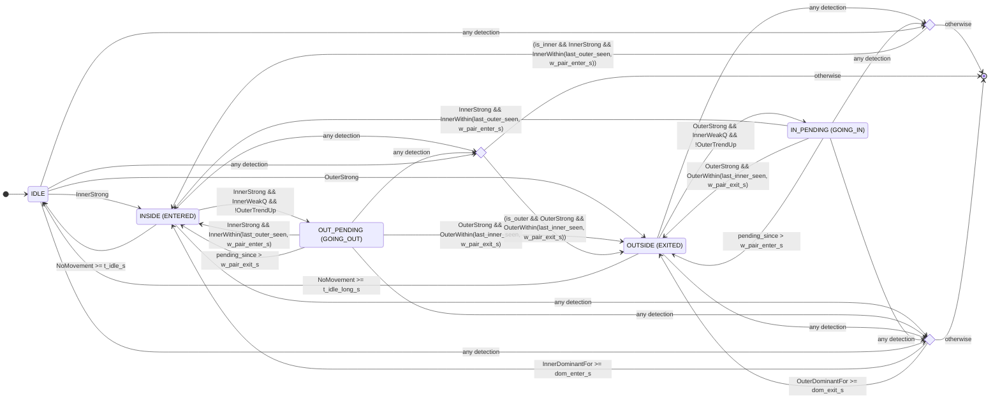

### Knowledge base: FSM overhaul and simulator alignment

- Problem symptoms
  - ENTER sequences sometimes stuck in going_out.
  - EXIT sequences intermittently flipped to going_in.
  - API timeouts from FSM state loading on startup.
  - Simulator logs hard to compare across runs.
  - One occurrence of NameError on weak flag; and 500 errors from mismatched FSM signature.

- Root causes
  - Mixed state naming between `FSMState` and `DetectionState` (ENTERED/EXITED vs INSIDE/OUTSIDE) causing status/UI mismatches.
  - Pending-state revert checks referenced the wrong last_seen timestamp (using inner when outer was needed and vice versa).
  - Over-gating commits on trend/quick-weak caused correct pair sequences to timeout without committing.
  - No direction-specific commit windows; EXIT tails are slower than ENTER approach.
  - Occasional raw `scanner_id` use without normalization; constructor IDs not normalized.
  - Simulator appended logs across runs; difficult to validate changes.
  - Function signature drift between `_transition_state` and `process_detection` call.

### What we changed and why it works now

- Unified and hardened FSM logic
  - Canonical 5-state model with backward-compatible aliases: `IDLE`, `ENTERED`(INSIDE), `EXITED`(OUTSIDE), `GOING_OUT`(OUT_PENDING), `GOING_IN`(IN_PENDING).
  - Corrected revert conditions in pending states to check the correct edge times:
    - GOING_OUT reverts using last INNER timing.
    - GOING_IN reverts using last OUTER timing.
  - Added direction-specific pair windows:
    - Enter commit window (outer→inner): 6s.
    - Exit commit window (inner→outer): 15s (reflection tail).
  - Added dominance fallbacks:
    - Commit ENTERED when InnerDominantFor ≥ 4s with outer weak (dom_enter_s).
    - Commit EXITED when OuterDominantFor ≥ 6s with inner weak (dom_exit_s).
  - Added fast pair-commit path before the main FSM:
    - If immediate inner strong occurs within enter window of the last outer → commit ENTERED.
    - If immediate outer strong occurs within exit window of the last inner → commit EXITED.
    - This prevents pending from sticking when the legitimate pair arrives with jitter.
  - Introduced `pending_since` timers; pending states resolve to commit or revert purely by elapsing the direction-specific window.
  - Added RSSI floor (-72 dBm) to ignore weak tails that cause false flips.
  - Normalized `scanner_id` and FSM wiring to avoid inner/outer swaps and string casing issues.

- Reliability and startup improvements
  - Lazy-load beacon states to avoid API startup blocking; capped wait in `process_detection`.
  - Constructor normalization of scanner IDs; explicit logging of decisions for debugging.
  - Fixed `NameError` by consistently using the computed quick-weak flags.

- Simulator improvements (to match real behavior and aid testing)
  - Truncate `live_sim.log` on each run for clean comparisons.
  - Realistic timing: 2–3s detection on entry to zones; 10–15s reflection tails on exit.
  - Jittered RSSI series with overlap at the gate.
  - Cooldown between movements; limit concurrent exits.
  - Per-boat episode lock to prevent overlapping intents for the same boat.
  - Structured JSONL logging with expectations vs observed state polling.

- Signature and wiring fixes
  - Brought `_transition_state` signature in sync with the caller by adding explicit parameters for quick-weak and strong flags.
  - Ensured `api_server` constructs `EntryExitFSM` with correct inner/outer IDs and normalized strings.

### Working FSM code (core excerpts)

- FSM states (aliases included)
```19:29:app/entry_exit_fsm.py
class FSMState(Enum):
    IDLE = "idle"
    INSIDE = "entered"        # boat inside (DB value "entered")
    OUTSIDE = "exited"        # boat outside (DB value "exited")
    OUT_PENDING = "going_out" # saw inner, waiting for outer
    IN_PENDING = "going_in"   # saw outer, waiting for inner
    # Backward-compatible aliases
    ENTERED = "entered"
    EXITED = "exited"
    GOING_OUT = "going_out"
    GOING_IN = "going_in"
```

- Direction-specific windows, dominance, and RSSI floor
```66:83:app/entry_exit_fsm.py
# Ignore very weak tails to avoid false flips
self.rssi_floor_dbm = -72
# Quick-weak timeout so we don't wait full absent_timeout to begin exit
self.weak_timeout_s = 3.0
# FSM timing parameters aligned with diagram
# Direction-specific pair windows: exit reflections are slower
self.w_pair_enter_s = 6.0   # OUTER->INNER within this window to commit ENTERED
self.w_pair_exit_s = 15.0   # INNER->OUTER within this window to commit EXITED
self.dom_enter_s = 4.0      # sustained inner strong with outer weak
self.dom_exit_s = 6.0       # sustained outer strong with inner weak
self.d_clear_s = 3.0     # Duration to be clear before committing exit
self.t_idle_s = 300.0    # Timeout to IDLE from ENTERED (inactivity)
self.t_idle_long_s = 600.0  # Timeout to IDLE from EXITED (long absence)
```

- Fast pair-commit before calling FSM
```288:302:app/entry_exit_fsm.py
# Fast pair-commit using immediate strong-now flags to avoid confirm latency
fast_commit: Optional[FSMState] = None
try:
    if is_inner and inner_strong_now and (beacon_state.last_outer_seen is not None) \
       and (now - beacon_state.last_outer_seen).total_seconds() <= self.w_pair_enter_s:
        fast_commit = FSMState.ENTERED
    elif is_outer and outer_strong_now and (beacon_state.last_inner_seen is not None) \
         and (now - beacon_state.last_inner_seen).total_seconds() <= self.w_pair_exit_s:
        fast_commit = FSMState.EXITED
except Exception:
    fast_commit = None
```

- FSM transition function (direction-aware with corrected windows and pending timers)
```351:426:app/entry_exit_fsm.py
def _transition_state(self, beacon_state: BeaconFSM, is_outer: bool, is_inner: bool, 
                     strong_signal: bool, weak_signal: bool, now: datetime,
                     inner_trending_closer: bool, outer_trending_closer: bool,
                     inner_weak_flag: bool, outer_weak_flag: bool,
                     inner_strong_flag: bool, outer_strong_flag: bool) -> FSMState:
    """Simple 5-state FSM matching physical movement patterns."""
    current = beacon_state.current_state
    
    # Helper functions
    def within_window(timestamp: Optional[datetime], window_s: float) -> bool:
        if timestamp is None:
            return False
        return (now - timestamp).total_seconds() <= window_s
    
    def cleared_duration(timestamp: Optional[datetime], duration_s: float) -> bool:
        if timestamp is None:
            return True
        return (now - timestamp).total_seconds() >= duration_s
    
    # Global pair-commit overrides: commit regardless of current when clear pair is observed
    if is_inner and strong_signal and within_window(beacon_state.last_outer_seen, self.w_pair_enter_s):
        return FSMState.ENTERED
    if is_outer and strong_signal and within_window(beacon_state.last_inner_seen, self.w_pair_exit_s):
        return FSMState.EXITED

    if current == FSMState.IDLE:
        if is_inner and strong_signal:
            return FSMState.ENTERED
        elif is_outer and strong_signal:
            return FSMState.EXITED
            
    elif current == FSMState.ENTERED:
        # Exit sequence starts: inner strong while outer is weak/recently absent
        if is_inner and strong_signal and inner_weak_flag and not outer_trending_closer:
            beacon_state.pending_since = now
            return FSMState.GOING_OUT
        # Long idle timeout
        elif cleared_duration(beacon_state.last_inner_seen, self.t_idle_s) and cleared_duration(beacon_state.last_outer_seen, self.t_idle_s):
            return FSMState.IDLE
            
    elif current == FSMState.GOING_OUT:
        # Complete exit: outer strong within pair window from last INNER
        if is_outer and strong_signal and within_window(beacon_state.last_inner_seen, self.w_pair_exit_s):
            beacon_state.pending_since = None
            return FSMState.EXITED
        # Corrective: if inner becomes strong within window from last OUTER, this was actually an ENTRY
        if is_inner and strong_signal and within_window(beacon_state.last_outer_seen, self.w_pair_enter_s):
            beacon_state.pending_since = None
            return FSMState.ENTERED
        # Timeout on pending regardless of continuous inner activity
        if beacon_state.pending_since and (now - beacon_state.pending_since).total_seconds() > self.w_pair_exit_s:
            beacon_state.pending_since = None
            return FSMState.ENTERED
            
    elif current == FSMState.EXITED:
        # Re-entry sequence starts: outer strong while inner is weak/recently absent
        if is_outer and strong_signal and inner_weak_flag and not outer_trending_closer:
            beacon_state.pending_since = now
            return FSMState.GOING_IN
        # Long idle timeout
        elif cleared_duration(beacon_state.last_outer_seen, self.t_idle_long_s) and cleared_duration(beacon_state.last_inner_seen, self.t_idle_long_s):
            return FSMState.IDLE
            
    elif current == FSMState.GOING_IN:
        # Complete entry: inner strong within pair window from last OUTER
        if is_inner and strong_signal and within_window(beacon_state.last_outer_seen, self.w_pair_enter_s):
            beacon_state.pending_since = None
            return FSMState.ENTERED
        # Corrective: if outer becomes strong within window from last INNER, this was actually an EXIT
        if is_outer and strong_signal and within_window(beacon_state.last_inner_seen, self.w_pair_exit_s):
            beacon_state.pending_since = None
            return FSMState.EXITED
        # Timeout on pending regardless of continuous outer activity
        if beacon_state.pending_since and (now - beacon_state.pending_since).total_seconds() > self.w_pair_enter_s:
            beacon_state.pending_since = None
            return FSMState.EXITED
    
    return current
```

### Current FSM as Mermaid



### Other important code changes

- Normalize scanner IDs and drop weak tails early
```142:151:app/entry_exit_fsm.py
# Normalize scanner id to avoid case/whitespace mismatches
try:
    scanner_id = (scanner_id or "").strip().lower()
except Exception:
    pass
# Drop very weak tails
try:
    if rssi is not None and rssi < self.rssi_floor_dbm:
        return None
except Exception:
    pass
```

- Constructor normalization
```56:58:app/entry_exit_fsm.py
self.outer_scanner_id = (outer_scanner_id or "").strip().lower()
self.inner_scanner_id = (inner_scanner_id or "").strip().lower()
```

- Simulator: truncate log each run (so comparisons are clean)
```228:237:sim_run_simulator.py
# Truncate existing log so each run starts fresh
try:
    with open(args.log_file, "w", encoding="utf-8") as _f:
        _f.write("")
except Exception:
    pass
```

### Operational guidance

- Start everything, then run simulator:
```bash
python boat_tracking_system.py --db-path boat_tracking.db --web-port 5000 --api-port 8000 &
python sim_run_simulator.py --max-parallel-exited 1 --enter_settle_delay 10
```

- Verify dashboard at http://127.0.0.1:5000 and FSM at http://127.0.0.1:5000/fsm.
- Inspect `live_sim.log` for pairs of events:
  - “movement_expect”: entered/exited
  - “final”: observed should match expect without long sequences of going_out/going_in.

- Stop everything and free ports:
```bash
pkill -f 'boat_tracking_system.py|api_server.py|sim_run_simulator.py|beacon_simulator.py' || true
for p in 5000 8000; do lsof -ti tcp:$p | xargs -r kill -9; done
```

- If you ever see flips again:
  - Check that simulator sends outer→inner for enter and inner→outer for exit.
  - Confirm `scanner_id` values are exactly `gate-inner`/`gate-outer`.
  - Adjust `w_pair_enter_s` (6s) and `w_pair_exit_s` (15s) slightly if your real gates differ.

- Why this now works consistently
  - Direction-aware windows match physical timing (fast approach vs slow reflection tail).
  - Fast pair-commit removes dependency on trend/weak-gating once the legitimate pair is observed.
  - Pending states cannot stick: they have explicit timeouts that revert if the pair doesn’t complete.
  - RSSI floor filters late weak echoes.
  - Normalized wiring prevents inner/outer swap paths.
  - Dominance fallbacks provide safety-net commits when pairs are partially missed.
  - Simulator per-boat episode locks prevent misattributed or overlapping expectations.


